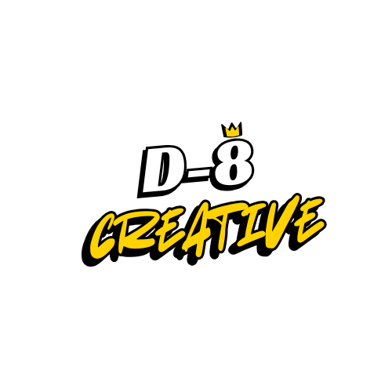

# ⚡ D-8 Creative | Impacto Visual & Estrategia Digital

  
  
<strong>Branding, Audiovisual & Full-Stack Development</strong>

  

---

## 🚀 Sobre el Proyecto
D-8 Creative es una plataforma de portfolio de alto rendimiento diseñada para exhibir la convergencia entre el **marketing estratégico**, la **producción audiovisual** y el **desarrollo web moderno**. Con una estética inspirada en el *Cyber-Retro* y una identidad visual basada en Pixel Art personalizado.

### ✨ Características Principales
* **Diseño UI/UX Disruptivo**: Interfaz oscura con acentos en *Brand Yellow* y efectos de profundidad 3D (Tilt Cards).
* **Arquitectura Escalable**: Navegación fluida implementada con `react-router-dom`.
* **Optimización Audiovisual**: Galerías integradas de YouTube e Instagram Reels con carga perezosa (lazy loading).
* **Gestión de Marca**: Sección dedicada a casos de éxito de branding y pauta publicitaria (Meta Ads).

## 🛠️ Tech Stack
* **Frontend**: [React.js](https://reactjs.org/) + [TypeScript](https://www.typescriptlang.org/)
* **Estilos**: [Tailwind CSS v4](https://tailwindcss.com/)
* **Animaciones**: [Framer Motion](https://www.framer.com/motion/)
* **Iconografía**: [Lucide React](https://lucide.dev/)
* **Despliegue**: Vercel / Netlify

## 📂 Estructura del Ecosistema
* **`/`**: Landing principal con propuesta de valor y servicios.
* **`/audiovisual`**: Galería de producciones cinematográficas y contenido vertical.
* **`/branding`**: Dashboard de gestión de marcas, métricas de Ads y soluciones Web.

## 📈 Casos de Éxito Incluidos
| Cliente | Servicio | Impacto |
| :--- | :--- | :--- |
| **J-Barber** | Web & Turnos | Automatización total de reservas. |
| **City Rock** | Carta Web | Digitalización de experiencia gastronómica. |
| **Coronada Jeans** | Meta Ads | Escalado de ventas y ROI positivo. |
| **Ecoplak** | Branding B2B | Autoridad de marca en sector construcción. |

---

## 👷 Instalación Local
1. Clona el repo: `git clone https://github.com/TU_USUARIO/d8-creative.git`
2. Instala dependencias: `npm install`
3. Corre el modo dev: `npm run dev`

---

  
Desarrollado con 💛 por <strong>David | D-8 Creative</strong>

  <a href="https://instagram.com/d8_creative">Instagram</a> • 
  <a href="https://j-barber.vercel.app">Proyectos Web</a>

